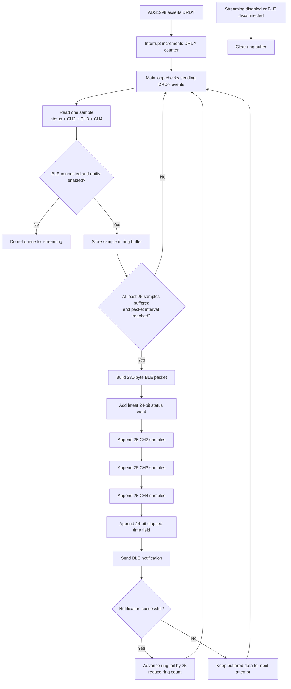

## Packet management

To handle the ECG data, each sample is stored within a custom structure that only contains the channels of interest, namely CH2, CH3, and CH4, together with the 24-bit status word. When the ADS1298 asserts the DRDY control signal, an interrupt is triggered and the nRF52840 records that a new sample is ready. In the main loop, each pending DRDY event is serviced by reading one sample from the ADC and placing it into a ring buffer. This buffering stage decouples data acquisition from BLE transmission, allowing samples to continue being captured even if the wireless link is temporarily delayed.

Once 25 samples have been accumulated, they are retrieved from the ring buffer as one batch, and the tail of the buffer advances by 25 positions. These 25 samples are then packed into a BLE payload together with additional metadata. The packet begins with a single 24-bit status word taken from the most recent sample in the batch, followed by 25 CH2 samples, 25 CH3 samples, and 25 CH4 samples. After the channel data, a final 24-bit field is appended to store the elapsed time in milliseconds since the previous packet was created. This results in a total packet size of 231 bytes. By grouping samples into one notification, the firmware reduces BLE overhead while still preserving the sequence of the ECG data and providing timing information for downstream reconstruction. To maintain a stable stream, packets are transmitted at intervals matched to the sampling rate, so that each packet represents 50 ms of ECG data at 500 Hz. If streaming stops or the BLE connection is lost, the ring buffer is cleared so that outdated samples are not transmitted later.

